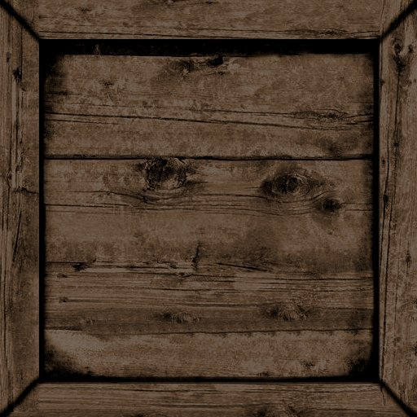
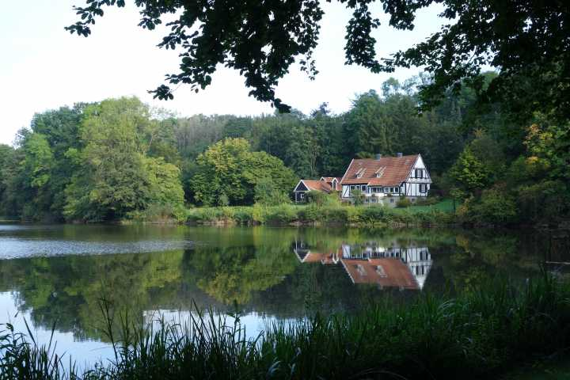
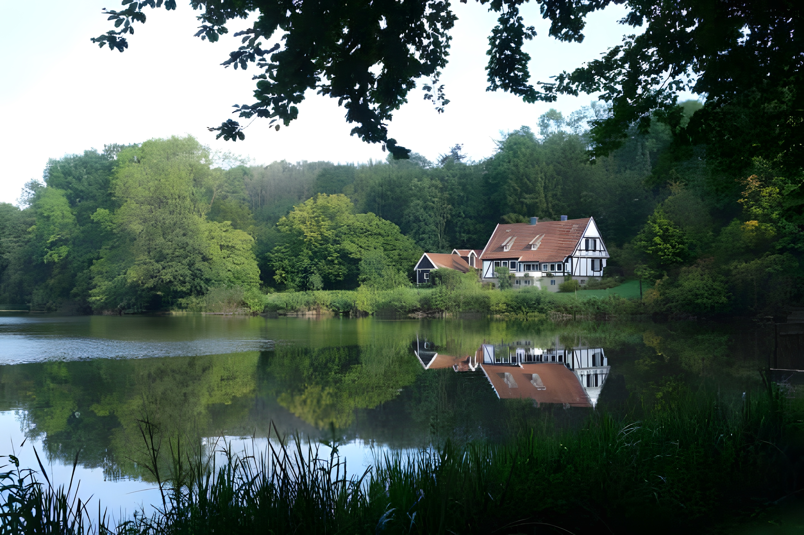

<!--  -->
<div align="center">
    
</div>

<!-- --- -->
# TexturePatch

Many game console emulators allow users to extract and replace textures, while decompiled games also provide opportunities to upscale and clean up their visuals. However, the legal landscape surrounding these texture modifications is complex. Players are generally free to tinker with textures they've extracted from games they own. But sharing those enhanced assets publicly would likely infringe on the original copyright holders' intellectual property rights.

This is where the TexturePatch tool comes into play. It enables artists/enhancers/modders to create publicly shareable "texture patches." These patches can then be applied by players to their own extracted game textures, allowing them to enjoy improved visuals without the risk of copyright infringement.

> [!WARNING]
> While TexturePatch has progressed beyond a proof-of-conept tool in its technical area, it still requires critical review by other people on its methods. Currently, we can _not_ guarantee patches are a safe format to be uploaded and whether it would be legal. We can only say that it is _very likely_ safe and _probably_ legal, unlike simply uploading modified versions of original textures as they are.

> [!NOTE]
For testing, be it successful or not; feel free to open an issue and let me know!

## Concept

The idea of this tool is to share the updating values, never the original or final values of an image. Let's say a gray-scale image looks like this, where $0$ represents black and $10$ represents white:

$$
Original = \begin{bmatrix}
1   & 4   & 6   \\
3   & 5   & 7   \\
4   & 2   & 8    
\end{bmatrix}
$$

And someone increased its saturation as follows:

$$
Modified = \begin{bmatrix}
0   & 4   & 6   \\
2   & 5   & 8   \\
4   & 1   & 10    
\end{bmatrix}
$$

What this tool will do (heavily simplified) is calculate its difference, and store it in a new image.

$$
Patch_{naive} = Modified - Original = \begin{bmatrix}
-1  & 0   & 0   \\
-1  & 0   & 1   \\
0   & -1  & 2    
\end{bmatrix}
$$

If we'd like to recreate our own modified image, we can simply calculate it as follows:

$$
Patched_{naive} = Original + Patch_{naive} = Modified
$$

This way the modified image never has to be published (only the patch), reducing the risk at copyright infringement. We've made a few simplifications in this example though.

1. Image dimensions may vary (i.e., $25\times25$ for the original and $300\times300$ for the modified one). Different dimensions are supported by the tool. In order to create a difference (patch), the eventual sizes must be the same, therefore the original image is resized to the modified image's dimension using a standard method (cubic interpolation).
1. The difference of two 8-bit images can only be faithfully stored using 9-bit $(0-255, 255-0)$, whereas the patch itself will be an 8 bit image. The tool adds sign descriptors at the bottom of the image and stores the absolute difference.

## Protecting the original image from reversing

Given that the formula in the concept is only a difference, one could simply reverse-calculate the original without ever requiring legal access to it.

$$
Reversed = Patch_{naive} - Modified = Original
$$

Similarly, when $Modified$ is already to be found somewhere publically, one wouldn't be able to publish $Patch_{naive}$, because it will also open the door to reversing the original. This is quite inpractical, especially since a few modified images had already been published. To address this limitation, a protected formula is used, seen below.

$$
Patch_{protected} = Modified - Original + Noise(Seed(Original))
$$
$$
Reversed = Modified - Patch_{protected} + Noise(0) \neq Original
$$

To correctly reverse the image, it is now necessary to have the original image (or just the seed), making the point of reversing the image pointless. The noise will have sufficiently high variance (currently 96 luminance levels) so that the reversed luminances will be too hard to correct, and the texture will be unusable as a texture. Moreover, the size information of the original texture is not added to the patch. This approach has the advantage that no key has to be shared around to share patches, they are extracted from the images individually.

Again, simplifications are made. Now, the range is no longer 9 bit (to maximally represent $(-256, 255)$), since the noise can overflow it. With $(0,n)$ being the range for the noise, the total patch range would become $(0-255+0, 255-0+n)$. Additional data will have to be stored. The lazy solution was to just add the occassions where the noise was inverted. This will be visible as the other row of mini textures.

## Protecting visible shapes in patches

Conceptually speaking, the difference between two similar images should be small, and thus the overall size of the image should also be smaller. However, when an image consists of random pixel values (i.e., "noise"), each of these pixels must be described individually, and thus the max potential compression ratio is smaller (concepts of image compression). Since this is the somewhat the case for a protected patch, its file size should be larger (even if the rows would be discarded).
<!-- These small differences tend to give away the edges present in a texture -- the overal shape. This is currently a consideration to make when using the tool. On the other hand, the colors can't be reversed, nor the size of the orignal image. Someone that does not have access to the original textures is time-wise better of obtaining them somewhere online illegally, than doing manual cleaning of the edges. (Attempts are welcome to see the effectiveness!) -->


More importantly, the differences between the original and modified image are the largest when there is a lot of local correction. These are often sharp edges of a logo, or drawn objects. These sharp images appear among texture packs more often than you'd expect. With photoshop tools, these edges can probably be extracted and used to repaint a new texture. Hence, the need arises to further obscure the visual space. On one hand, it is nice to recognize the images, especially for debugging, but on the other hand, it shouldn't be too easy to photoshop it.

Simple pattern swaps (i.e., rotating pixels on black tiles of the chess board) that don't require a seed will already make it hard for most people to do something practical with the patch or a reversed image, but these patterns are also easy to revert with scripting knowledge, since the algorithm can be inspected. (It definitelly won't help that we provide a filtering and filter-reversing tools ourselves!) Patterns can also incorporate noise to determine swap and/or shift positions, which is what we will end up doing.

## Usage

The script can only be executed with python installed. It requires both open cv and numpy to be added to a default installation.

Help can be found for each command running `main.py --help` and `main.py create --help` and so on. Below, we'll give example commands for [crate-brown-wood.jpg](./demo/crate-brown-wood.jpg). (Be careful, paths in the example have png and jpg extensions!)

### `create`

Running the following command will create a patch texture [crate-brown-wood-patch.png](./demo/crate-brown-wood-patch.png) given the paths to the original and modified textures. This method currently also works recursively on directories.

```console
python main.py create ./demo/crate-brown-wood.jpg ./demo/crate-brown-wood-modified.png ./demo/crate-brown-wood-patch.png
```

Filters can be passed, to further obfuscate the patch's shape. Some of them will require the original image as a seed, which will automatically be provided. For patches filtered using the seed, the original images are required to deobfuscate them before applying them. For now, they are omitted in the demo on reversing.

```console
python main.py create ./demo/crate-brown-wood.jpg ./demo/crate-brown-wood-modified.png ./demo/crate-brown-wood-patch.png --filters roll-h roll-v roll-v
```

### `apply`

Running the following command will apply the patch to the original texture and create [crate-brown-wood-patch.png](./demo/crate-brown-wood-patch.png). This method currently also works recursively on directories.

```console
python main.py apply ./demo/crate-brown-wood.jpg ./demo/crate-brown-wood-patch.png ./demo/crate-brown-wood-patched.png
```

And just like before, you can pass filters to deobfuscate the patches. The order that these filters get removed is reversed from what is passed through the command line. The filters themselves are inverted.

```console
python main.py apply ./demo/crate-brown-wood.jpg ./demo/crate-brown-wood-patch.png ./demo/crate-brown-wood-patched.png --filters roll-h roll-v roll-v
```

### `diff`

A patch creator can ensure their patches will apply well -- matches exactly -- by running the following command, which supports directories. For two images, it will print the difference values `(min, max)`, which in the case of the specific command below will print `(0, 0)` since an pixel-wise comparison between the exact same images is always 0.

```console
python main.py diff ./demo/crate-brown-wood-modified.png ./demo/crate-brown-wood-patched.png
```

Adding a third path will always generate a difference image, in which completely white represents no change, blue represents luminance decrease and red represents luminance increase. Since this is a one dimensional view on 3 channels, all channels (R, G, B) had been added up for comparison. The following command will additionally create a difference image [crate-brown-wood-patch-{firstname}-{secondname}.png](./demo/crate-brown-wood-difference-modified-patched-crate-brown-wood-modified-crate-brown-wood-patched.png). This auto-naming behavior will change in the future.

```console
python main.py diff ./demo/crate-brown-wood-modified.png ./demo/crate-brown-wood-patched.png ./demo/crate-brown-wood-difference-modified-patched.png
```

### `reverse`

Finally, to see if the noise is large enough, the following command will create a reversed image [crate-brown-wood-reversed.png](./demo/crate-brown-wood-patch.png) with using 0 for each noise value -- since the original is presumed not to be accessible and thus unknown.

```console
python main.py reverse ./demo/crate-brown-wood-modified.png ./demo/crate-brown-wood-patch.png ./demo/crate-brown-wood-reversed.png
```

You can pass in the this image to `diff` to compare the differences with the "original" modified image.

### `test`

To run all these commands for just two images, the following command will create all these textures at the location of the modified texture.

```console
python main.py test ./demo/crate-brown-wood.jpg ./demo/crate-brown-wood-modified.png
```

It would be the equivalent of running (although some names will get a version number for now).

```console
python main.py create  ./demo/crate-brown-wood.jpg          ./demo/crate-brown-wood-modified.png ./demo/crate-brown-wood-patch.png
python main.py apply   ./demo/crate-brown-wood.jpg          ./demo/crate-brown-wood-patch.png    ./demo/crate-brown-wood-patched.png
python main.py diff    ./demo/crate-brown-wood-modified.png ./demo/crate-brown-wood-patched.png  ./demo/crate-brown-wood-difference-modified-patched.png
python main.py reverse ./demo/crate-brown-wood-modified.png ./demo/crate-brown-wood-patch.png    ./demo/crate-brown-wood-reversed.png
python main.py diff    ./demo/crate-brown-wood-reversed.png ./demo/crate-brown-wood-patched.png  ./demo/crate-brown-wood-difference-reversed-patched.png
```

### `test-filter`

To preview the effectiveness of a filter, one can apply them to a certain image. Some filters require a seed (image) to invert them, which is when `--seed` must be provided for both applying and removing a filter. Providing no seed will use the first image as a seed.

```console
python main.py test-filter ./demo/logo-patch.png ./demo/logo-patch-filtered.png filter1 filter2 filter3
```

To remove the filters, use the same list and pass `--inverted`. Another way to achieve the same is to prepend the names with `i` and reverse the order of the filters. **Don't forget to pass the same  `--seed ./demo/logo-patch.png`, omitted below!**

```console
python main.py test-filter ./demo/logo-filtered.png ./demo/logo-patch-inverted.png --inverted filter1 filter2 filter3 # automatically convert to second command below
python main.py test-filter ./demo/logo-filtered.png ./demo/logo-patch-inverted.png ifilter3 ifilter2 ifilter1 # exactly the same
```

### `process`

Finally, one can execute an arbitrary command on the images, as an optional post-processing step. This may be useful to automatically upscaler/enhance each image in a certain directory given input (`[:original:]`) and output (`[:processed:]`) placeholders. The command below will pass the images in `./textures` one by one as `[:original:]` to `cp` and its resulting images will be stored at `./textures-copy` one by one as `[:processed:]`.

```console
python main.py process "cp [:original:] [:processed:]" ./textures ./textures-copied # on a directory
```

One individual texture can be processed either, but it has no point really, as it can be written directly in the terminal without placeholders.

```console
python main.py process "cp [:original:] [:processed:]" ./textures/foo.png ./textures/foo-copy.png # on a file
cp ./textures/foo.png ./textures/foo-copy.png # the same
```

The default placeholders can be overriden, if that is necessary, using `--placeholder-input`, and `--placholder-output`. Make sure the custom placeholders won't occur elsewhere in the template, because _all_ occurrences will be filled in!

```console
# example placeholders
python main.py process "cp iiii ((o))" ./textures/foo.png ./textures/foo-copy.png --input-placeholder iiii --output-placeholder "((o))"
cp ./textures/foo.png ./textures/foo-copy.png # the same

# BAD placeholder(s)
python main.py process "cp o p" ./textures/foo.png ./textures/foo-copy.png --input-placeholder "o" --output-placeholder "c"
c./textures/foo-copy.png ./textures/foo.png ./textures/foo-copy.png # the same
```

This also useful for end users that wish to further compress the images without dataloss, given that [Open CV appears to increase the size of the image](https://stackoverflow.com/questions/12216333/opencv-imread-imwrite-increases-the-size-of-png). Below, we demonstrate that an image loaded and written unmodified gets a larger file size.

```python
>>> import cv2
>>> image = cv2.imread("./demo/logo.png", cv2.IMREAD_UNCHANGED) # 1.16 MB
>>> cv2.imwrite("./demo/logo-written.png", image) # suddenly 1.31 MB
True
```

Several compression tools exist for lossless (or lossy) compression, some even have python wrapped libraries. Some tools have a higher compression ratio at the expense of time, some prioritize time more. However, some players might not even want to waste this additional time on files that will look the same anyway. For this reason, we leave it up to the player to decide what additional tools should be run on the images. Below are a few tools, in no particular order, some of which are lossy.

- [pngcrush](https://pmt.sourceforge.io/pngcrush/)
- [pngcrunch](https://github.com/the-real-neil/pngcrunch/)
- [optipng](https://optipng.sourceforge.net/)
- [kenutils](https://www.jonof.id.au/kenutils.html)
- [crunch](https://github.com/chrissimpkins/Crunch)
- [zopfli](https://github.com/google/zopfli)
- [fpng](https://github.com/richgel999/fpng)
- [pngquant](https://github.com/kornelski/pngquant)

For those wondering, as of now, you can't run the tool's `create` or `apply` using `process`, as it works on a predefined number (2) on paths, and those commands require three paths.

## Demo

To demonstrate the results, we'll show two images that are patched and lastly demonstrate filters for further obfuscation.

### crate-brown-wood.jpg

We took a publically avaiable $512\times512$ texture for a wooden crate from [opengameart.org](https://opengameart.org/content/box-and-barrel-textures-crate-brown-wood.jpg). This image had been shamelessly upscaled using [Upscayl](https://github.com/upscayl/upscayl) to a $2560\times2560$ image. All textures the tool has generated for this image can be found in [demo](./demo/).

| <center>[$Original$](./demo/crate-brown-wood.jpg)</center> | <center>[$Modified$](./demo/crate-brown-wood-modified.png)</center> | <center>[$Patch$](./demo/crate-brown-wood-patch.png)</center> | <center>[$Patched$](./demo/crate-brown-wood-patched.png)</center> | <center>[$Reversed$](./demo/crate-brown-wood-reversed.png)</center> | <center>[$Diff(M,P)$](./demo/crate-brown-wood-difference-modified-patched-crate-brown-wood-modified-crate-brown-wood-patched.png)</center> | <center>[$Diff(M,R)$](./demo/crate-brown-wood-difference-reversed-patched-crate-brown-wood-reversed-crate-brown-wood-patched.png)</center> |
|-|-|-|-|-|-|-|
|  |  |  |  |  |  |  |

Notice that the original is a jpg, but the modified is a png. This is why the modified texture can still be faithfully recreated with the patch, unlike the next texture, which has a modified jpg texture.

### CF_DSC05592.jpg

We took a publically availabe $720\times480$ image from [duion.com](https://duion.com/art/photos/cfdsc05592jpg) to test modified jpgs and upscaled with Upscayl to $4320\times2880$. Notice that the patch should still be a png to preserve as much information as possible, but even though it gets faithfully recreated, the data will be written and small changes invisible to the eye will occur -- this image will print out `(-19, 19)` for the difference between patched and modified.

| <center>[$Original$](./demo/duion-art-photos-CF_DSC05592.JPG)</center> | <center>[$Modified$](./demo/duion-art-photos-CF_DSC05592-modified.jpg)</center> | <center>[$Patch$](./demo/duion-art-photos-CF_DSC05592-patch.png)</center> | <center>[$Patched$](./demo/duion-art-photos-CF_DSC05592-patched.jpg)</center> | <center>[$Reversed$](./demo/duion-art-photos-CF_DSC05592-reversed.jpg)</center> | <center>[$Diff(M,P)$](./demo/duion-art-photos-CF_DSC05592-difference-modified-patched-duion-art-photos-CF_DSC05592-modified-duion-art-photos-CF_DSC05592-patched.jpg)</center> | <center>[$Diff(M,R)$](./demo/duion-art-photos-CF_DSC05592-difference-reversed-patched-duion-art-photos-CF_DSC05592-reversed-duion-art-photos-CF_DSC05592-patched.jpg)</center> |
|-|-|-|-|-|-|-|
|  |  |  |  |  |  |  |

<!-- Features (shape) from the original image are not immediately present, but generally speaking, they are not random either. It can be said that with this approach much more information on the original image is hidden than uploading the manually upscaled image itself.

It is clearly not just a random image. The patch in itself will contain some information on the texture. This can be obfuscated visually, but it will be there either way in some form. -->

### Jak and daxter: The Precursor Legacy logo

For this test, we took the [logo](https://static.wikia.nocookie.net/jakanddaxter/images/1/14/The_Precursor_Legacy_logo_2.png/revision/latest?cb=20180531194636) from the Jak and Daxter wiki and downscaled it using `cv2.resize` -- it looked too good already! (In all seriousness, old games probably have small images, whereas nowadays _bigger is better<sup>TM</sup>_ thus we should test for large upscales starting from small images.) Then we created a patch.

Now, applying filters to this patch separately. Once can exactly reverse this image. Notice how only the outline is visible. This is simply because the pixels in between have the same alpha channel, and they can subtracted from each other. In case these are not similar, information will be visible. For demo purposes, we divided the alpha channel by two, and added $128$, to ensure all values are in the range $(128, 255)$. Below are upscales 32, 16, 8, 4, 2 each on a separate row to demonstrate the effectiveness of the filters `roll-h roll-v`. Since they can be reversed given the seed, they of course have 0 differences (white images).

| <center>patched</center> | <center>alpha-shifted</center> | <center>filtered (roll)</center> | <center>inversed</center> | <center>difference</center> |
|-|-|-|-|-|
|  |  |  |  |  |
|  |  |  |  |  |
|  |  |  |  |  |
|  |  |  |  |  |
|  |  |  |  |  |

We did not bother to additionally write an algorithm with $Noise(0)$ to view what it would look like without the correct seed. For some filters, it would simply do nothing! Or, just use any other `--seed` that previously used, it will also look off.

<!-- TODO: Example image here. -->

## Roadmap

In its current state, three packs have been created and applied successfully to textures on Windows, of which the last was cross-platform tested with Linux. (None of these tests included filters.)

- Mysterious Dash HD Textures
- Jak1 HD UI textures
- Jak1 ESRGAN Edition v1.0.1
- Snowover_Release_v0.1.4
- Mountain_Ash_Release_v0.1.4
- Meaty_Swamp_Release_v0.1.4
- JAK2_hd_hud
- Jak2-HD-Textures-For-OpenGOAL-main

So far, the created patches don't seem to have issues when crossing platforms. For the last pack, one patch was created using Windows and was succesfully applied using Linux; another patch was created using Linux and succesfully applied using Windows. (There is an exception that caught on patching on Linux that may have slipped on Windows as well on images in Jak and Daxter's `gamefont` folder.

The tool has a minimal CLI that allows recursively creating patches for all PNGs and recursively applying patches. Given that the concept has been implemented to most extent and is practically useful, there isn 't much left planned. Here are a few things.

- [x] Fix an outdated assertion that fails when the header row is bigger than the image size.
- [x] Test whether issues arise when applying patches created on one platform (Windows) on images on another platform (Linux)
- [ ] Try out more packs created for other games than those in the Jak and Daxter series or supported by the [OpenGOAL project](https://opengoal.dev/).
- [ ] Have the concept/tool get assessed/reviewed by others with any level of expertise (legal, image processing, image compression, decompiling, ...)
- [x] Support directories for `diff`
- [x] ~~Support directories for `reverse`, `test`, `test-filter`~~
- [x] Support `--filters` in `create`, `apply`
- [x] Check if paths exist instead of crashing
- [x] Prevent duplicate path arguments where it's probably unintended
- [ ] Add an option to `--overwrite` and do not overwrite by default
- [ ] Read options from a json settings file in the current directory if exists.
- [x] Allow for the definition of a generic `process` command, so people can decide themselves what to do additionally (e.g., run a certain compression tool).
- [ ] Also provide example `process` commands for on the compression tools.
- [ ] Explanation, summary (#files, list of directories) and confirm continue, `-y`/`--yes`.
- [ ] Investigate patch to patch.
    - Update only updated textures or patch.
    - Should also require noise depending on what is the update.
    - Doesn't make sense if you'd have to chain multiple `apply`s, instead of doing it once.
- [ ] Investigate some automatic level of noise detection is required per image to reduce unnecessary noise size for patches with less edges.
- [ ] Setup process to automatically produce an exe that can run on Windows, Linux, Mac.

## Q & A

1. _Can't someone publish these keys and a modification of a reversing algorithm to extract the original images that requires just the patch and the modified textures?_ Sure, but in any case, they can just as well upload the original or modified textures, which is much less of a hassle.
1. _Are 16-bit png images supported?_ Yes, but no. The patching works, but it is not yet meant to be used. The original image has to be scaled (**which is currently not the case!**), otherwise, there will be very little difference visible (0-255) compared to (0-65535), and the patch can be just downsampled, creating a very good attempt at reversing the original.
1. _Are jpgs images supported?_ JPGs are a lossy format (that I personally wouldn't expect for games), thus to create a patch for them that results in the exact same jpg is unlikely. The tool creates a png patch, but upon storing the eventual patched image as jpg, some of the data gets lost. This would/should be the case as well when reading and directly writing the image -- yet to be tried. These differences are hardly visible to the eye.
1. _What are these iccp warnings?_ I'm not sure exactly ([some corruption of the modified image](https://stackoverflow.com/questions/22745076/libpng-warning-iccp-known-incorrect-srgb-profile)), but the goal is to exactly recreate the image. If the modified image is corrupted before patched, then the eventual patched image will have it too.
1. _Is this method safe?_ For now, I'd say yes. However, I strongly suspect this hashing is not quantum computing safe, as most contemporary encryption algorithms. Since "only" $2^{32}-1$ keys exist, so for each image, one could just try them all at once with a quantum computer and determine which match the best with the modified image using an algorithm. But then again, it takes quite a lot of effort. This should only be a concern for the game company that 1) may want to publish patches (which is unlikely, because why not provide an update to do so instead), or 2) allows artists to publish patches on publically unavailable textures (but that in itself is already extremely unlikely). All the other people that have the goal of finding the original textures waste much less time searching for them online, sadly.
1. _Can't the shapes of patches be used to recreate a texture_ I don't know, but let's say no. I have almost no photoshop skills. The craziest I could think of are people aligning screenshots of gameplay with shapes in patches, in which way they would have a name and eventually a texture they can modify or use as-is, but as usual, what would be the point. In case the textures hadn't been published before, they would presumably have to spend a lot of time figuring out which texture it is. I welcome anyone to attempts these extreme scenario's.
<!-- . When that time comes, the textures should be taken offline. It still extra work to reverse a patch and a modified version to the original image, but it is certainly possible. At the same time. I don't expect anyone to put in the effort to reverse textures, if they can be found somewhere. The only unsafe use case is when this were to be used by a company that allowed artists to work on the original textures and publish them as patches. Anyone else will just grab them somewhere -- it is way too time consuming to reverse this! -->

